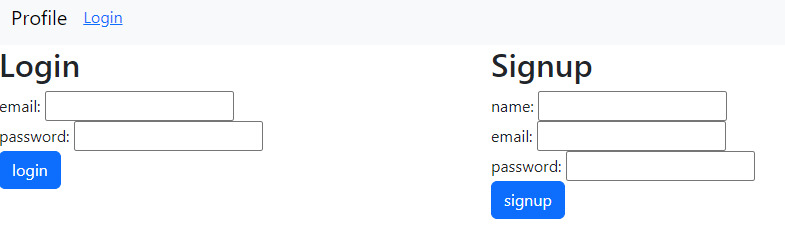

# Chainsaw Tech Blog

## Description
Website link: https://musical-chainsaw.onrender.com/  

Chainsaw Tech Blog is a website where users can sign up or login to their account to see blog posts about the tech industry.   This website was built using an MVC paradigm.   MVC paradigm makes it easier to understand the functionality of the front end and back end.   The model and views folder contain all the back end work, while the views allows us to see what the user will experience. 

## Installation

To run the back end in this project, you will need to do an "npm install" to install express and sequelize packages.   
An "npm start" command inside the terminal will start up the server to test out the user and post routes. 

## Usage
Go to https://musical-chainsaw.onrender.com/ and create a user using the sign up form.    
  
If you already have a user, go ahead and sign in using your email and password.  
Once inside the "Chainsaw tech blog" you can navigate to the dashboard to create a new post.   
   
Once you finish adding a title and content to your post, your post will be created and displayed in the home page of the website.   
